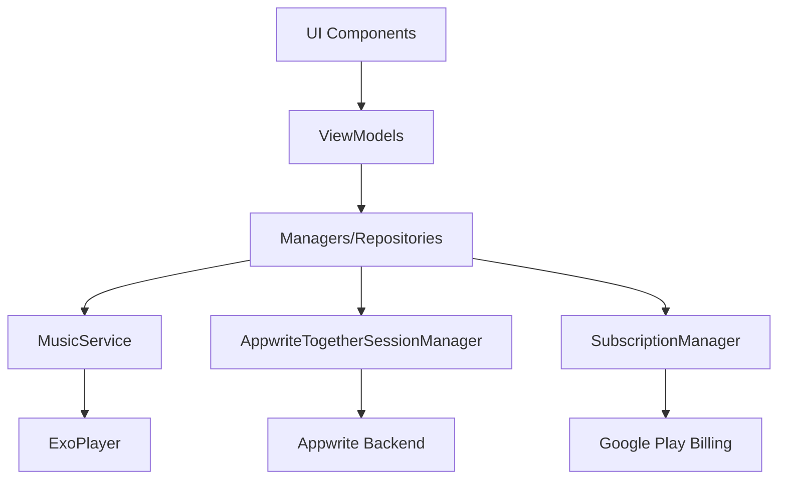
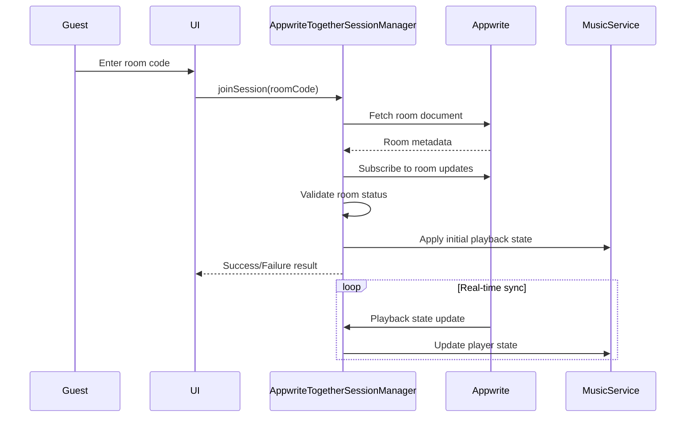
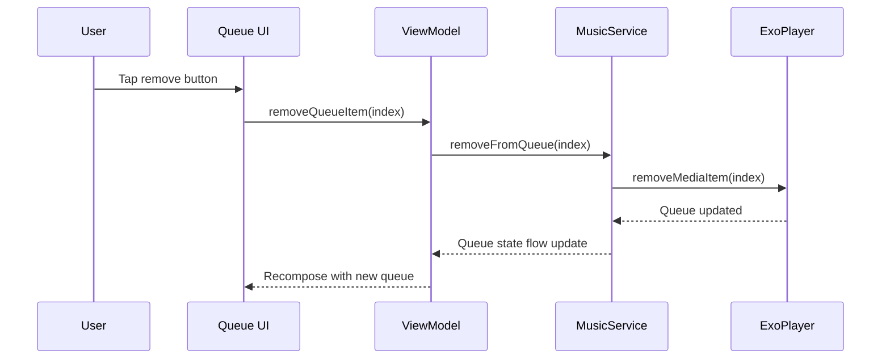
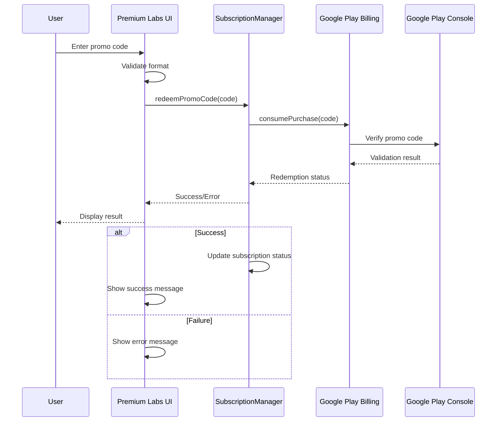

# Design Document: App Improvements and Fixes

## Overview

This design document covers eight distinct improvements to the Echofy Android music streaming application. The improvements span multiple areas including collaborative listening (Together Sessions), UI/UX enhancements, subscription management, widget functionality, and premium features. Each improvement is designed to enhance user experience while maintaining the existing architecture and minimizing disruption to current functionality.

### Scope

The design addresses:
1. **Together Session Join Functionality** - Fix guest connection and synchronization issues
2. **Settings UI Cleanup** - Remove visual clutter from settings interface
3. **Apple Music-Style Player Scroll Behavior** - Implement auto-hiding player on scroll
4. **Queue Management Improvements** - Add song removal and hide currently playing song
5. **Premium Subscription Simplification** - Streamline subscription options
6. **Compact Widget Creation** - Develop a 2x2 home screen widget
7. **Together Section UI Improvements** - Enhance Together Session interface
8. **Premium Labs Promo Code Feature** - Implement promo code redemption

### Technology Stack

- **Language**: Kotlin
- **UI Framework**: Jetpack Compose
- **Architecture**: MVVM with Hilt dependency injection
- **Media Playback**: Media3 (ExoPlayer)
- **Backend**: Appwrite (for Together Sessions)
- **Billing**: Google Play Billing Library
- **Widget**: Android AppWidget framework

## Architecture

### High-Level Architecture

The application follows a layered architecture:

```
┌─────────────────────────────────────────┐
│         UI Layer (Compose)              │
│  - Screens, Components, ViewModels      │
└─────────────────────────────────────────┘
                  ↓
┌─────────────────────────────────────────┐
│       Domain/Business Logic Layer       │
│  - Managers, Repositories, Use Cases    │
└─────────────────────────────────────────┘
                  ↓
┌─────────────────────────────────────────┐
│          Data/Service Layer             │
│  - MusicService, Appwrite, Billing      │
└─────────────────────────────────────────┘
```

### Component Interaction



## Components and Interfaces

### 1. Together Session Join Functionality

#### Components

**AppwriteTogetherSessionManager** (Existing - Requires Fixes)
- Location: `app/src/main/java/com/Chenkham/Echofy/jam/AppwriteTogetherSessionManager.kt`
- Responsibilities:
  - Manage Together Session lifecycle
  - Handle guest join operations
  - Synchronize playback state between host and guests
  - Maintain real-time connection via Appwrite

**Key Methods to Fix:**
```kotlin
suspend fun joinSession(rawRoomCode: String, displayName: String?): Result<JamActiveSession>
private suspend fun attachToSession(session: JamActiveSession): Result<JamActiveSession>
private fun applyRoomDocToPlayback(meta: JamRoomMeta, session: JamActiveSession)
```

#### Data Flow



#### Issues to Address

1. **Connection Timing**: Guest join validation may timeout before room document is fetched
2. **Synchronization Lag**: Initial playback state not applied immediately after join
3. **Error Handling**: Insufficient error messages for connection failures
4. **Race Conditions**: Realtime subscription may not be established before first update

#### Solution Approach

1. **Eager Fetching**: Fetch room document before subscribing to realtime updates
2. **Immediate Application**: Apply fetched playback state synchronously after successful join
3. **Enhanced Validation**: Add retry logic with exponential backoff for room fetching
4. **Detailed Errors**: Map Appwrite exceptions to user-friendly error messages

### 2. Settings UI Cleanup

#### Components

**SettingsScreen** (Existing - Requires Modification)
- Location: `app/src/main/java/com/Chenkham/Echofy/ui/screens/settings/SettingsScreen.kt`
- Responsibilities:
  - Render settings categories and items
  - Handle navigation to sub-settings screens
  - Display current setting values

#### UI Changes

**Before:**
```
┌─────────────────────────┐
│ Setting Item            │ →
├─────────────────────────┤  ← Slim line
│ Another Setting         │ →
├─────────────────────────┤
│ Third Setting           │ →
└─────────────────────────┘
```

**After:**
```
┌─────────────────────────┐
│ Setting Item            │
│                         │
│ Another Setting         │
│                         │
│ Third Setting           │
└─────────────────────────┘
```

#### Implementation Strategy

1. **Remove Dividers**: Remove `Divider()` composables between settings items
2. **Remove Arrow Icons**: Remove trailing icon parameters from settings items
3. **Adjust Spacing**: Increase vertical padding to maintain visual separation
4. **Maintain Clickability**: Ensure all interactive elements remain functional

### 3. Apple Music-Style Player Scroll Behavior

#### Components

**AppleBottomSheetPlayer** (Existing - Requires Enhancement)
- Location: `app/src/main/java/com/Chenkham/Echofy/ui/player/AppleBottomSheetPlayer.kt`
- Responsibilities:
  - Display full-screen player interface
  - Handle lyrics and queue display
  - Manage player visibility based on scroll

**New Component: ScrollAwarePlayerContainer**
- Responsibilities:
  - Detect scroll direction and velocity
  - Animate player visibility
  - Coordinate with lyrics and queue scroll states

#### Scroll Behavior Logic

```kotlin
sealed class PlayerVisibility {
    object Visible : PlayerVisibility()
    object Hidden : PlayerVisibility()
    data class Transitioning(val progress: Float) : PlayerVisibility()
}

class ScrollAwarePlayerController {
    private var lastScrollOffset = 0f
    private val hideThreshold = 100f // pixels
    
    fun onScroll(delta: Float): PlayerVisibility {
        lastScrollOffset += delta
        return when {
            lastScrollOffset > hideThreshold -> PlayerVisibility.Hidden
            lastScrollOffset < -hideThreshold -> PlayerVisibility.Visible
            else -> PlayerVisibility.Transitioning(
                lastScrollOffset / hideThreshold
            )
        }
    }
}
```

#### Animation Specifications

- **Duration**: 250ms (within 200-400ms requirement)
- **Easing**: FastOutSlowInEasing for natural feel
- **Properties**: Translate Y offset and alpha
- **Trigger Distance**: 100 pixels scroll

### 4. Queue Management Improvements

#### Components

**Queue** (Existing - Requires Enhancement)
- Location: `app/src/main/java/com/Chenkham/Echofy/ui/player/Queue.kt`
- Responsibilities:
  - Display upcoming songs in queue
  - Handle queue item interactions
  - Sync with MusicService queue state

**MusicService** (Existing - Requires Modification)
- Location: `app/src/main/java/com/Chenkham/Echofy/playback/MusicService.kt`
- New Method: `removeFromQueue(mediaItemIndex: Int)`

#### Queue Display Logic

```kotlin
@Composable
fun QueueList(
    currentMediaItem: MediaItem?,
    queueItems: List<MediaItem>,
    onRemove: (Int) -> Unit
) {
    val filteredQueue = queueItems.filterIndexed { index, item ->
        // Exclude currently playing song
        item.mediaId != currentMediaItem?.mediaId
    }
    
    LazyColumn {
        itemsIndexed(filteredQueue) { index, item ->
            QueueItem(
                item = item,
                onRemove = { onRemove(index) }
            )
        }
    }
}
```

#### Remove Operation Flow



### 5. Premium Subscription Simplification

#### Components

**SubscriptionManager** (Existing - Requires Modification)
- Location: `app/src/main/java/com/Chenkham/Echofy/ads/SubscriptionManager.kt`
- Responsibilities:
  - Manage Google Play Billing connection
  - Query available products
  - Handle purchase flows
  - Track subscription status

**PremiumScreen** (Existing - Requires Simplification)
- Location: `app/src/main/java/com/Chenkham/Echofy/ui/screens/premium/PremiumScreen.kt`
- Changes:
  - Display only 2 subscription options
  - Remove exaggerated feature descriptions
  - Simplify UI layout

#### Subscription Product IDs

```kotlin
object SubscriptionProducts {
    const val MONTHLY = "premium_monthly_15"  // ₹15/month
    const val TWO_YEAR = "premium_2year_399"  // ₹399/2 years
    
    // Remove these:
    // const val FIVE_YEAR = "premium_5year"
    // const val LIFETIME = "premium_lifetime"
}
```

#### Feature List Simplification

**Remove:**
- Exaggerated claims ("unlimited", "exclusive")
- Features not actually implemented
- Marketing language

**Keep:**
- Ad-free experience
- Offline downloads
- High-quality audio
- Together Sessions
- Premium Labs access

### 6. Compact Widget Creation

#### Components

**CompactMusicWidget** (Existing - Requires Enhancement)
- Location: `app/src/main/java/com/Chenkham/Echofy/CompactMusicWidget.kt`
- Current Status: Basic implementation exists
- Enhancements Needed:
  - Optimize layout for 2x2 grid
  - Add app logo
  - Improve visual design
  - Ensure all controls are functional

#### Widget Layout

```xml
<!-- widget_music_compact.xml -->
<RelativeLayout>
    <!-- Top Row: Logo + Song Info -->
    <ImageView id="@+id/widget_compact_logo" />
    <TextView id="@+id/widget_compact_song_title" />
    
    <!-- Middle: Album Art -->
    <ImageView id="@+id/widget_compact_album_art" />
    
    <!-- Bottom Row: Controls -->
    <ImageButton id="@+id/widget_compact_prev" />
    <ImageButton id="@+id/widget_compact_play_pause" />
    <ImageButton id="@+id/widget_compact_next" />
</RelativeLayout>
```

#### Widget Dimensions

- **Size**: 2x2 grid cells
- **Minimum Width**: 110dp
- **Minimum Height**: 110dp
- **Target Width**: 180dp
- **Target Height**: 180dp

#### Update Strategy

```kotlin
class CompactMusicWidget : AppWidgetProvider() {
    companion object {
        private const val UPDATE_INTERVAL_MS = 2000L
        
        fun updateAllWidgets(context: Context) {
            val playerConnection = PlayerConnection.instance
            val player = playerConnection?.player
            
            // Update song info
            val title = player?.mediaMetadata?.title
            val artist = player?.mediaMetadata?.artist
            val artworkUri = player?.mediaMetadata?.artworkUri
            val isPlaying = player?.isPlaying == true
            
            // Update all widget instances
            val appWidgetManager = AppWidgetManager.getInstance(context)
            val widgetIds = appWidgetManager.getAppWidgetIds(
                ComponentName(context, CompactMusicWidget::class.java)
            )
            
            widgetIds.forEach { widgetId ->
                updateWidget(context, appWidgetManager, widgetId, 
                    title, artist, artworkUri, isPlaying)
            }
        }
    }
}
```

### 7. Together Section UI Improvements

#### Components

**EchofyJamSheet** (Existing - Requires Modification)
- Location: `app/src/main/java/com/Chenkham/Echofy/ui/component/EchofyJamSheet.kt`
- Changes:
  - Disable swipe-down gesture
  - Add explicit close button
  - Scale player to full screen height
  - Fill bottom empty space

#### UI Modifications

**Gesture Handling:**
```kotlin
@OptIn(ExperimentalMaterial3Api::class)
@Composable
fun TogetherSessionSheet(
    sheetState: SheetState,
    onDismiss: () -> Unit
) {
    ModalBottomSheet(
        sheetState = sheetState,
        onDismissRequest = { /* Disabled */ },
        dragHandle = null, // Remove drag handle
        properties = ModalBottomSheetProperties(
            shouldDismissOnBackPress = false
        )
    ) {
        Column(modifier = Modifier.fillMaxHeight()) {
            // Close button at top left
            IconButton(
                onClick = onDismiss,
                modifier = Modifier.align(Alignment.Start)
            ) {
                Icon(Icons.Default.Close, "Close")
            }
            
            // Player content - fills remaining space
            TogetherPlayerContent(
                modifier = Modifier
                    .fillMaxWidth()
                    .weight(1f)
            )
        }
    }
}
```

**Layout Strategy:**
- Use `Modifier.fillMaxHeight()` for main container
- Use `Modifier.weight(1f)` for player content
- Add background color to fill any gaps
- Ensure touch targets remain accessible

### 8. Premium Labs Promo Code Feature

#### Components

**New Component: PromoCodeRedemption**
- Location: `app/src/main/java/com/Chenkham/Echofy/ui/screens/premium/PromoCodeRedemption.kt`
- Responsibilities:
  - Display promo code input field
  - Validate code format
  - Submit code to Google Play
  - Display redemption status

**SubscriptionManager** (Enhancement)
- New Method: `redeemPromoCode(code: String): Result<RedemptionStatus>`

#### Promo Code Flow



#### Promo Code Validation

```kotlin
data class PromoCodeValidation(
    val isValid: Boolean,
    val errorMessage: String? = null
)

fun validatePromoCodeFormat(code: String): PromoCodeValidation {
    return when {
        code.isBlank() -> PromoCodeValidation(
            false, "Promo code cannot be empty"
        )
        code.length < 6 -> PromoCodeValidation(
            false, "Promo code must be at least 6 characters"
        )
        !code.matches(Regex("[A-Z0-9-]+")) -> PromoCodeValidation(
            false, "Promo code contains invalid characters"
        )
        else -> PromoCodeValidation(true)
    }
}
```

#### Google Play Integration

The promo code feature integrates with Google Play Console's subscription giveaway functionality:

1. **Setup**: Create promo codes in Google Play Console
2. **Distribution**: Share codes with users
3. **Redemption**: Users enter codes in Premium Labs
4. **Validation**: Google Play Billing validates and applies subscription
5. **Status Update**: App reflects new subscription status

## Data Models

### Together Session Models

```kotlin
// Existing models - no changes needed
data class JamActiveSession(
    val roomCode: JamRoomCode,
    val participantId: String,
    val role: JamParticipantRole,
    val displayName: String?,
    val authUid: String? = null
)

data class JamRoomMeta(
    val roomId: String,
    val roomCode: String,
    val hostParticipantId: String,
    val allowGuestControls: Boolean,
    val status: String,
    val mediaId: String,
    val title: String,
    val artist: String,
    val thumbnailUrl: String,
    val durationSeconds: Int,
    val playbackState: String,
    val positionMs: Long,
    val updatedAtEpochMs: Long,
    val stateVersion: Long,
    val issuedByParticipantId: String
)
```

### Queue Models

```kotlin
// Existing - used by MusicService
data class QueueItem(
    val mediaItem: MediaItem,
    val index: Int,
    val isCurrentlyPlaying: Boolean
)
```

### Subscription Models

```kotlin
data class SubscriptionProduct(
    val productId: String,
    val title: String,
    val price: String,
    val description: String,
    val billingPeriod: String
)

data class PromoCodeRedemption(
    val code: String,
    val status: RedemptionStatus,
    val message: String? = null
)

enum class RedemptionStatus {
    PENDING,
    SUCCESS,
    INVALID_CODE,
    ALREADY_REDEEMED,
    EXPIRED,
    ERROR
}
```

### Widget Models

```kotlin
data class WidgetState(
    val songTitle: String,
    val artist: String,
    val artworkUrl: String?,
    val isPlaying: Boolean
)
```

## Error Handling

### Together Session Errors

```kotlin
sealed class TogetherSessionError : Exception() {
    data class RoomNotFound(val roomCode: String) : TogetherSessionError()
    data class RoomClosed(val roomCode: String) : TogetherSessionError()
    data class ConnectionTimeout(val roomCode: String) : TogetherSessionError()
    data class SyncFailure(val reason: String) : TogetherSessionError()
    data class InvalidRoomCode(val code: String) : TogetherSessionError()
}

fun TogetherSessionError.toUserMessage(): String = when (this) {
    is RoomNotFound -> "Room not found. Please check the code and try again."
    is RoomClosed -> "This room has ended."
    is ConnectionTimeout -> "Connection timed out. Please check your internet and try again."
    is SyncFailure -> "Failed to sync playback: $reason"
    is InvalidRoomCode -> "Invalid room code format."
}
```

### Subscription Errors

```kotlin
sealed class SubscriptionError : Exception() {
    object BillingUnavailable : SubscriptionError()
    object UserCancelled : SubscriptionError()
    object ItemAlreadyOwned : SubscriptionError()
    data class PurchaseFailed(val responseCode: Int) : SubscriptionError()
    data class PromoCodeInvalid(val code: String) : SubscriptionError()
}
```

### Queue Operation Errors

```kotlin
sealed class QueueError : Exception() {
    data class InvalidIndex(val index: Int) : QueueError()
    object EmptyQueue : QueueError()
    object OperationNotAllowed : QueueError()
}
```

## Testing Strategy

This feature set involves primarily UI/UX improvements, configuration changes, and integration with external services (Appwrite, Google Play Billing). Property-based testing is not applicable for these types of changes. Instead, the testing strategy focuses on:

### Unit Tests

**Together Session Manager Tests:**
- Test room code validation logic
- Test error message mapping
- Test playback state synchronization logic
- Mock Appwrite responses for various scenarios

**Subscription Manager Tests:**
- Test promo code format validation
- Test subscription status updates
- Mock Google Play Billing responses
- Test error handling for billing failures

**Queue Management Tests:**
- Test queue filtering (exclude current song)
- Test remove operation index calculations
- Test queue state updates

### Integration Tests

**Together Session Integration:**
- Test full guest join flow with mock Appwrite backend
- Test real-time synchronization with simulated updates
- Test error scenarios (network failure, invalid codes)

**Billing Integration:**
- Test purchase flow with Google Play Billing test environment
- Test promo code redemption with test codes
- Test subscription status persistence

### UI Tests (Compose)

**Settings Screen:**
- Verify dividers are removed
- Verify arrow icons are removed
- Verify all settings remain clickable

**Player Scroll Behavior:**
- Test scroll detection triggers hide/show
- Test animation completes within time bounds
- Test player visibility state transitions

**Queue UI:**
- Verify current song is excluded from display
- Verify remove button appears for each item
- Verify queue updates after removal

**Widget:**
- Test widget layout in 2x2 grid
- Test control button functionality
- Test widget updates on song change

### Manual Testing

**Together Sessions:**
- Test guest join with real room codes
- Verify playback synchronization accuracy
- Test error messages for various failure scenarios

**Subscription:**
- Test purchase flows for both subscription tiers
- Test promo code redemption with real codes
- Verify subscription status updates correctly

**Widget:**
- Test widget on various Android versions
- Test widget on different launcher apps
- Verify widget updates within 2 seconds

### Performance Testing

**Widget Updates:**
- Measure widget update latency (target: <2s)
- Test battery impact of widget updates
- Test memory usage of widget instances

**Player Animations:**
- Measure scroll animation frame rate (target: 60fps)
- Test animation smoothness on low-end devices
- Verify no jank during scroll

### Regression Testing

- Verify existing Together Session host functionality unchanged
- Verify existing subscription features still work
- Verify existing widget functionality preserved
- Verify player controls remain responsive
- Verify queue operations don't affect playback

## Implementation Approach

### Phase 1: Bug Fixes and Core Improvements (Priority: High)

**Week 1-2:**
1. **Together Session Join Fix**
   - Debug current join flow
   - Implement eager room document fetching
   - Add retry logic with exponential backoff
   - Enhance error messages
   - Test with multiple devices

2. **Queue Management**
   - Implement remove functionality in MusicService
   - Filter current song from queue display
   - Add remove button UI
   - Test queue state synchronization

### Phase 2: UI/UX Enhancements (Priority: Medium)

**Week 3:**
3. **Settings UI Cleanup**
   - Remove dividers from settings screens
   - Remove arrow icons
   - Adjust spacing
   - Test all settings navigation

4. **Player Scroll Behavior**
   - Implement scroll detection
   - Add player visibility animations
   - Test in lyrics and queue sections
   - Optimize animation performance

5. **Together Section UI**
   - Disable swipe-down gesture
   - Add close button
   - Scale player to full height
   - Fill bottom space

### Phase 3: Subscription and Premium Features (Priority: Medium)

**Week 4:**
6. **Subscription Simplification**
   - Update SubscriptionManager product IDs
   - Simplify PremiumScreen UI
   - Remove unused subscription tiers
   - Update feature descriptions
   - Test purchase flows

7. **Promo Code Feature**
   - Implement PromoCodeRedemption UI
   - Add redemption logic to SubscriptionManager
   - Integrate with Google Play Billing
   - Test with test promo codes
   - Add error handling

### Phase 4: Widget Enhancement (Priority: Low)

**Week 5:**
8. **Compact Widget**
   - Optimize layout for 2x2 grid
   - Add app logo
   - Improve visual design
   - Test on multiple launchers
   - Optimize update frequency

### Implementation Guidelines

**Code Quality:**
- Follow existing Kotlin coding conventions
- Use Jetpack Compose best practices
- Maintain MVVM architecture
- Add comprehensive comments for complex logic

**Testing:**
- Write unit tests for all new business logic
- Add UI tests for critical user flows
- Perform manual testing on multiple devices
- Test on Android versions 8.0+

**Performance:**
- Profile widget update performance
- Optimize animation frame rates
- Minimize network calls in Together Sessions
- Cache subscription status locally

**Error Handling:**
- Provide user-friendly error messages
- Log errors for debugging
- Implement graceful degradation
- Add retry mechanisms where appropriate

**Documentation:**
- Update inline code documentation
- Document API changes
- Create user-facing help text
- Update README if needed

## Dependencies

### Existing Dependencies (No Changes)
- Jetpack Compose
- Media3 (ExoPlayer)
- Appwrite SDK
- Google Play Billing Library
- Hilt (Dependency Injection)
- Coil (Image Loading)
- Kotlin Coroutines

### Configuration Changes

**Google Play Console:**
- Create promo codes for subscription giveaways
- Configure subscription products (₹15/month, ₹399/2 years)
- Remove old subscription tiers

**Appwrite:**
- No configuration changes needed
- Existing Together Session collections sufficient

## Deployment Considerations

### Version Compatibility
- Minimum Android SDK: 26 (Android 8.0)
- Target Android SDK: 34 (Android 14)
- Compile SDK: 34

### Migration Strategy

**Subscription Migration:**
- Existing subscribers remain unaffected
- Old subscription tiers grandfathered
- New users see only 2 options

**Widget Migration:**
- Existing widgets continue to work
- Users can add new compact widget
- No automatic migration needed

### Rollout Plan

**Phase 1: Beta Testing (Week 6)**
- Release to internal testers
- Gather feedback on Together Session fixes
- Test promo code redemption
- Verify widget functionality

**Phase 2: Staged Rollout (Week 7-8)**
- 10% rollout to production
- Monitor crash reports and ANRs
- Monitor Together Session success rates
- Monitor subscription conversion rates

**Phase 3: Full Release (Week 9)**
- 100% rollout to all users
- Monitor key metrics
- Prepare hotfix if needed

### Monitoring and Metrics

**Together Sessions:**
- Guest join success rate
- Average synchronization latency
- Error rate by error type

**Subscriptions:**
- Conversion rate for new tiers
- Promo code redemption rate
- Promo code validation failure rate

**Widget:**
- Widget installation rate
- Widget update latency
- Widget crash rate

**Player Behavior:**
- Scroll animation frame rate
- User engagement with auto-hide feature

**Queue Management:**
- Queue remove operation frequency
- Queue display performance

## Security Considerations

### Promo Code Security
- Validate promo code format before submission
- Rate limit promo code attempts (max 5 per minute)
- Log all redemption attempts for audit
- Use Google Play's built-in validation

### Together Session Security
- Existing Appwrite security rules sufficient
- Room codes are randomly generated
- No sensitive data exposed in room documents

### Subscription Security
- Use Google Play Billing for all transactions
- Verify purchases server-side (existing)
- Store subscription status locally with encryption

## Accessibility

### Widget Accessibility
- Add content descriptions to all buttons
- Ensure minimum touch target size (48dp)
- Support TalkBack navigation

### UI Accessibility
- Maintain sufficient color contrast
- Add content descriptions to icons
- Support screen readers
- Ensure keyboard navigation works

### Together Session Accessibility
- Provide audio feedback for connection status
- Add descriptive labels to all controls
- Support accessibility services

## Conclusion

This design document provides a comprehensive technical approach for implementing eight distinct improvements to the Echofy application. The improvements are prioritized based on user impact and implementation complexity, with bug fixes and core functionality taking precedence over cosmetic enhancements.

The phased implementation approach allows for iterative development and testing, reducing risk and enabling early feedback. The testing strategy focuses on integration tests and manual testing appropriate for UI/UX changes and external service integrations.

All improvements maintain the existing architecture and follow established patterns in the codebase, ensuring consistency and maintainability. The design emphasizes user experience, performance, and reliability while minimizing disruption to existing functionality.

